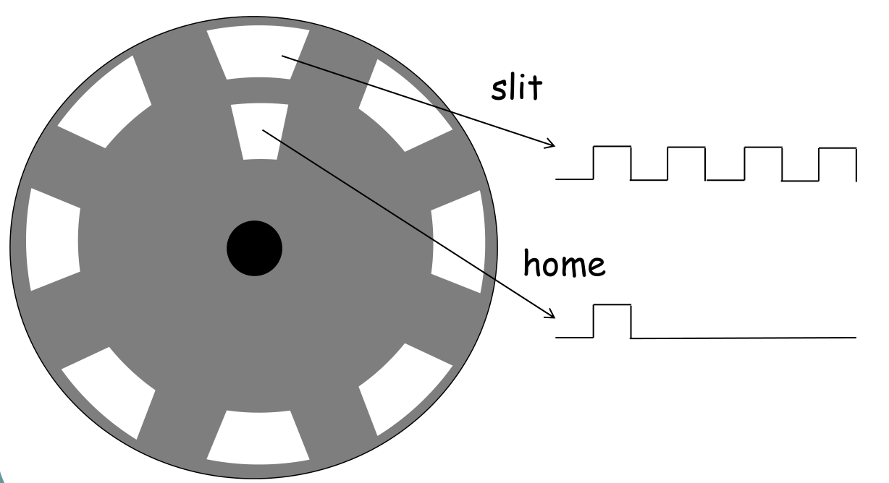

# Incremental Encoder (FreeRTOS)

FreeRTOS implementation of an incremental (single-channel) encoder exercise.
The system reads an emulated encoder output and continuously reports:

- **Count** (number of rising edges of `slit`)
- **Speed (RPM)** computed from the elapsed time between two consecutive **home** events (`home_slit`)

This project is based on two assignment briefs:
- ES06: RT-POSIX incremental encoder exercise (original specification)
- HW02: FreeRTOS port of the same exercise

---

## Encoder signals (slit & home)

The encoder emulator produces two signals:

- `slit`: square wave used for edge counting
- `home_slit`: pulse that marks the “home” position (typically once per revolution)

---

## High-level architecture

### Tasks (FreeRTOS)

A typical mapping of the assignment requirements to FreeRTOS tasks is:

- **Encoder Emulator Task** *(provided or implemented)*  
  Generates `slit` and `home_slit` and writes them to shared memory.

- **Counter Task (Real-Time)**  
  Reads `slit`, detects **rising edges**, updates the global **count**.

- **Home-Period Task (Real-Time)**  
  Detects `home_slit` events and measures the time **Δt** between two consecutive home pulses.
  Stores the last measured period (e.g., in microseconds).

- **Scope / UI Task (Buddy / Non-RT)**  
  Reads shared data, computes **RPM**, and prints/logs:
  - count
  - RPM

Optional (if implemented in your version):
- **Slack / Diagnostic Task** (periodic, e.g., 10 ms)  
  Measures/aggregates timing slack and prints an average every N activations.

---

## Shared data & synchronization

The tasks share a small set of variables/structures (signals and computed outputs).
Access is protected with a **FreeRTOS mutex** (recommended) to avoid race conditions.

Notes:
- Keep the printing/UI task at **lower priority** so it does not disturb real-time tasks.
- FreeRTOS mutexes provide **priority inheritance**, which helps mitigate priority inversion.

---

## RPM computation

If `home_slit` occurs **once per revolution**, then:

- `rpm = 60 / Δt_seconds`

Where `Δt_seconds` is the time between two consecutive home events.  
(If your emulator generates multiple home pulses per turn, adjust accordingly.)
